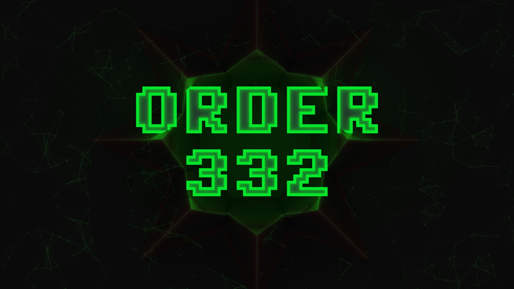

# what is this?
spotify on hackerone has told me in 12/26/2021 that they don't see any attack vectors in sourcemaps so i decided to publish these publicly.
have fun. 😁
UPDATE: Hackerone has just contacted me about this at 16/07/2022 and I have told them to 

## Their message

# contributions?
you can create an issue with the sourcemaps or contribute with a PR (file integrity will be checked)

# proof????? 🤓🤓🤓
feel free to read `2021-12-28_report_1437087.pdf` and `2021-12-28_report_1436047.pdf`

# whoami
find me on the internet by searching `dirt3009` (disclaimer: I'm not on Twitter.)
you can also DM me on discord @ dirt#3009

# disclaimers
this repo was not made with educational purposes, it was made %100 with malintent to Spotify AB and company.
that is also why NO file has been redacted

